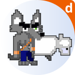
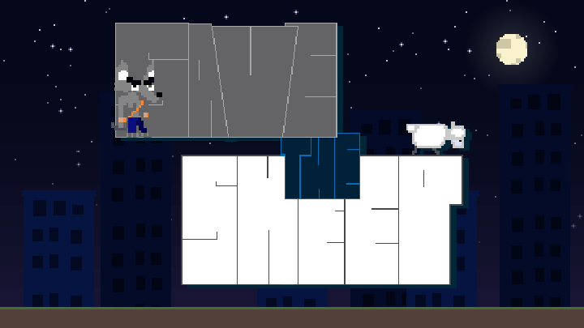
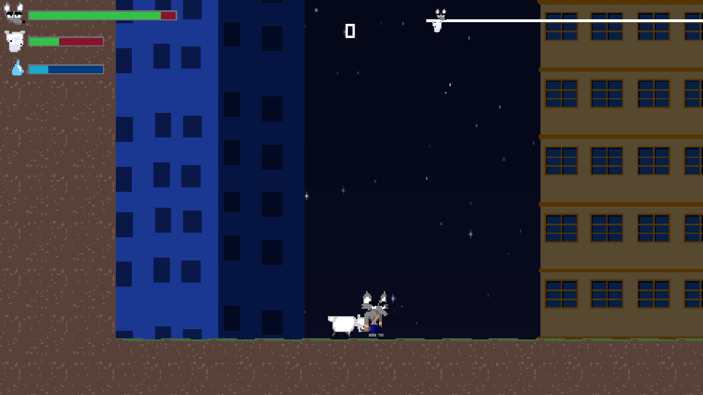
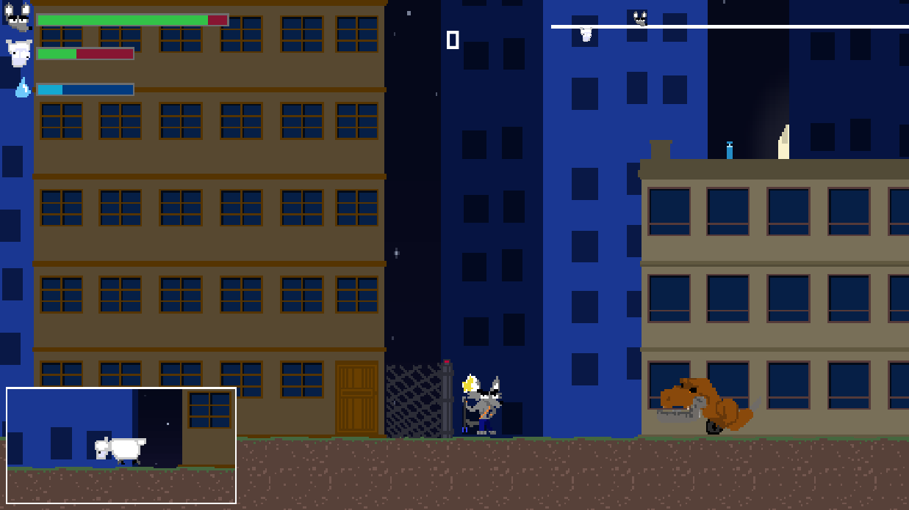
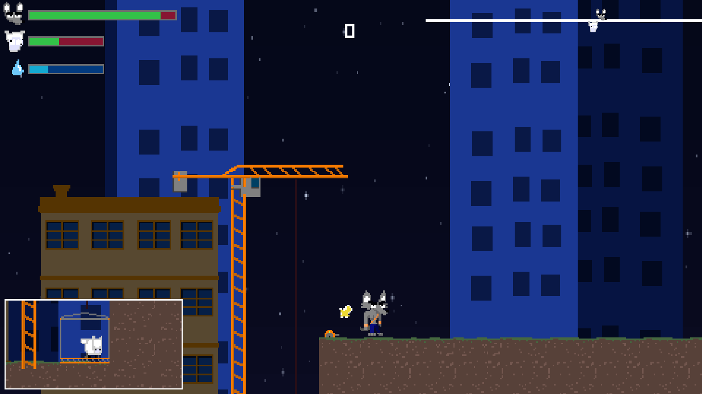

<div align="center">



# 🐑 Save the Sheep

**An arcade action game where you keep the sheep alive to finish every level.**

<a href="https://dupot-org.itch.io/save-the-sheep"></a>

*Run, jump, blast dinosaurs with your water gun and get the sheep home safe.*

**[▶ Play it now in your browser](https://dupot-org.itch.io/save-the-sheep)** · **[Get it on Flathub](https://flathub.org/apps/org.dupot.savethesheep)**

Free · Age 3+ · Linux x86_64 & aarch64 · Web · Made with Godot 4.7

[](https://flathub.org/apps/org.dupot.savethesheep)
[](https://snapcraft.io/dupot-save-the-sheep)
[](https://dupot-org.itch.io/save-the-sheep)
[](https://godotengine.org)
[](LICENSE)

<a href="https://flathub.org/apps/org.dupot.savethesheep"></a>
<a href="https://snapcraft.io/dupot-save-the-sheep"></a>

</div>

---

## 📖 About

Gordon has one job: **protect the sheep**. The sheep walks on its own, and Gordon has to clear the way so it can reach the end of each level in one piece.

- 🌃 **A city at night**: run and jump across rooftops, streets and building sites under a starry sky
- 💦 **Water gun**: blast the enemies (dinosaurs included!) before they reach the sheep
- 🚪 **Action handle**: open gates to let the sheep through
- 🛗 **Elevators**: turn them on to carry the sheep over obstacles
- 🎁 **Bonus level**: an extra challenge for those who make it

If the sheep doesn't make it, neither do you.

## 📸 Screenshots

<div align="center">

| Level start | Watch out for the T-Rex! | Elevator time |
|:---:|:---:|:---:|
|  |  |  |

</div>

## 🎮 Controls

| Action | Keyboard |
|---|---|
| Move | ← → arrow keys |
| Jump | `Space` or `Z` |
| Shoot | `Enter` or `A` |
| Action (gates, elevators) | `Tab` or `E` |

🎮 Gamepads are supported too, and Android gets on-screen touch controls.

## 📦 Install

### Flathub (Linux, recommended)

Available for **x86_64** and **aarch64** (around 35 MiB to download).

```bash
flatpak install flathub org.dupot.savethesheep
flatpak run org.dupot.savethesheep
```

You can also install it from GNOME Software, KDE Discover or any app store that uses Flathub. The Flatpak manifest lives in [flathub/org.dupot.savethesheep](https://github.com/flathub/org.dupot.savethesheep).

### Snap Store (Linux)

```bash
sudo snap install dupot-save-the-sheep
```

### itch.io (browser)

Play it in your browser, no install needed: **[dupot-org.itch.io/save-the-sheep](https://dupot-org.itch.io/save-the-sheep)**

## 🛠️ Build from source

1. Install [Godot 4.7](https://godotengine.org/download).
2. Clone the repository:
   ```bash
   git clone https://github.com/imikado/dupotSaveTheSheep.git
   ```
3. Open `project.godot` in Godot and press **F5** to play.

Export presets for **Linux**, **Android** and **HTML5** are included in `export_presets.cfg`.

## 🕹️ More from dupot.org

Also on Flathub from the same developer:

- **Little Adventure**
- **Beat And Match To Pass**
- **Easyflatpak**

See them all on [dupot.org](https://www.dupot.org/games.html).

## 🐛 Feedback

Found a bug or have an idea? [Open an issue](https://github.com/imikado/dupotSaveTheSheep/issues).

## 📜 License

This game is released under the [GNU LGPL v2.1](LICENSE).

---

<div align="center">

Made with ❤️ and [Godot Engine](https://godotengine.org) by [Michael Bertocchi](https://www.dupot.org/games.html) · [dupot.org](https://www.dupot.org)

</div>
